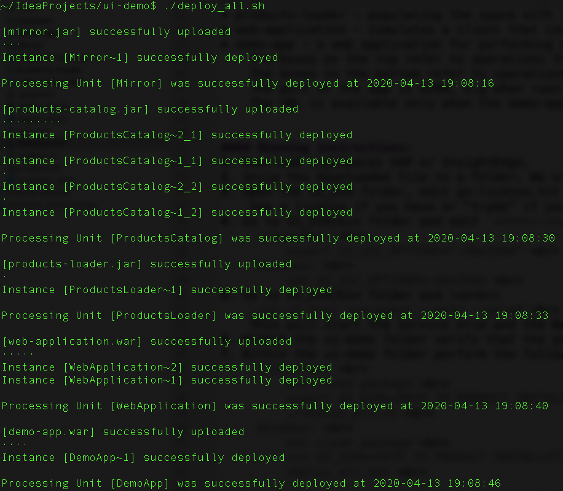

# UI Demo

#### Overview:
This repo includes number of services (pu's) that demonstrates the functionality of GigaSpaces Ops Manager. 
After Deployed, Demo-app enables to perform some operations on the cluster and see the effects on the UI.  

#### Project structure:
##### The project consist of the following services:
* mirror
* products-catalog(space) - defaults topology is 2,1 (as set at './deploy_all.sh/bat').
* products-loader - populating the space with 100000 Products with each deployment.
* web-application - simulates a client that constantly performs read operations on the space for Products, with a property of maxEntriesPerSecond.
* demo-app - a web application for performing operations on the service grid include 2 kinds of operations: 
    The boxes on the top refer to operations that cause different alerts on the service grid. 
    The boxes on the bottom refer to operations include create/remove container and scale up/down service. 
    The port of the app is 8280, e.g when running on localhost, it's accessible using http://localhost:8280/ 
    The URL is available only when the demo-app service is deployed. 

#### Running instructions:
1. Download GigaSpaces XAP or InsightEdge.
2. Unzip the downloaded file to a folder. We will reference it with GS_DIR.
3. Open the GS_DIR folder, edit gs-license.txt file.
    Use a license if you have or "tryme" if you don't.
4. Go to GS_DIR/bin folder and edit `setenv-overrides.sh/bat` file.  Add the following: 
    `Linux/Mac:` 
        `export GS_GSC_OPTIONS="-Xmx256m"` 
    `Windows:` 
        `set GS_GSC_OPTIONS=-Xmx256m` 
5. Go to GS_DIR/bin folder and run 
   `./gs.sh host run-agent --auto --gsc=9` 
    This will start the Service Grid and the New UI will be available at http://localhost:8090/
6. Within the ui-demo folder verify that the pom.xml has the correct gsVersion: 
7. Within the ui-demo folder perform the following: 
    `Linux/Mac:` 
        `mvn clean package` 
        `export GS_DIR=<PATH TO PRODUCT INSTALLATION>` 
        `./deploy_all.sh` 
    `Windows:` 
        `mvn clean package` 
        `set GS_DIR=<PATH TO PRODUCT INSTALLATION>` 
        `deploy_all.bat` 
* e.g deploy.sh screen shot: 

